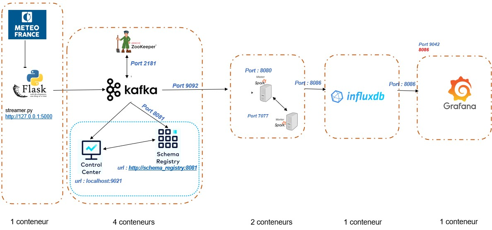

# PROJECT: BIG DATA WEATHER
This project aims at displaying meteo data streamed through a datapipeline. The chosen data is hourly weather measurements from Haute Garonne during year 2023. Kafka is to be used for streaming data to Spark (Pyspark in that case). As the amount of data is limited, HDFS will not be configured and Influx DB will store data, requested for vizualisation on Grafana. 

_Authors: Grégory Bimbault, Théo Rybarczyk_

## Architecture



## Deployment scripts

### Build and setup

- First, a `settings.sh` file is availble if you want to modify some of the parameters used in the multiple services used foir this project. In particular, you can activate or deactivate Kafka monitoring using the `KAFKA_MONITOR` flag variable. If you chose to activate this monitoring, a second Docker compose yml file will also be used for the `docker compose up` command. You can also set multiple Spark worker using the `SPARK_WORKER_NUMBER` parameter. It will replicate the Spark worker service in the Docker compose.

- Then, run the `build_setup.sh` script to build Docker images and instanciate the corresponding containers.

- Then, run the `start-streaming.sh` to start streaming data to Kafka (topics creation). By default the time delta between two streamed rows is 50ms.

- Finally, run the `submit.sh` to start the Spark Streaming application. Please start the streaming before (otherwise the Kafka topic won't exist).

- Once the data streaming is working, you can change live the time step between two streamed data rows by using the `modify_streaming_timedelta.sh` script. It sends a POST command with a new time delta argument (in seconds). For instance, if you want to change the time delta to 0.01s you just need to use the following command: `source modify_streaming_timedelta.sh 0.01`.

You can run the last three in other terminals as `settings.sh` will be called to get the necessary parameters' value.

The setup of InfluxDB and Grafana services will be done automatically after containers are all started.

- Open http://localhost:3000 (assuming default port was used) with your favorite browser to access the Grafana interface (user: `admin`, password: `admin`).

- Some other web interfaces accesses (with default ports):   
    - Kafka control center (won't exist if you set `KAFKA_MONITOR` to 0): http://localhost:9021 
    - Spark interface : http://localhost:8080
    - Influx DB interface : http://localhost:8086 (by default, user: `admin`, password: `adminvaldom`)
    
### Stop and clean
Run the `clean.sh` script in order to stop and delete containers in execution, remove `influxVolume` Docker volume and delete images.

## Components and Remarks

### Data streamer
We selected data to stream from [this csv file](https://object.files.data.gouv.fr/meteofrance/data/synchro_ftp/BASE/HOR/H_31_latest-2023-2024.csv.gz]) taken from the meteo.data.gouv.fr website. The data streaming Python application is a Flask server (port 5000 by default) that sends the data to Kafak in a json format.
This streaming application is containerized in a Docker container (built using Dockerfile.datastream).

For the purpose of this project, following data fields will be streamed : meteo station name, GPS position, temperature, precipitations, humidity, visibility, pressure and wind force and direction. 
If you wish to add fields to the stream (with a view to visualize them), this involves the following actions :
- add the field to "spark_app.py" ,
- add  the field in the Influx DB bucket,
- configure the dashboard with the new data.

#### Dependencies : 
- for Python:  kafka-Python (for the Kafka producer) / Flask / pandas

### Kafka

Kafka manages streaming data from data producers to data consumers.

Kafka Docker images used for this project are from [Confluentic v7.4.0](https://hub.docker.com/u/confluentinc).
During the deployment, Kafka is first to be started (zookeeper --> broker --> schema_registry --> contreol_center).

For this project, we used a single broker but many can be used in parallel for scalability and fault tolerance.

Zookeeper is managing the Kafka broker and the broadcast of data. Broker is storing the received data and sends them to consumers that subscribed to the corresponding topic (we created a topic 'meteo' in this project). Data is streamed through bootstrap servers (broker:29092) to, in our case, a Spark application that consumes the data.

In order to monitor Kafka, health-check of containers are executed every 30 seconds and execution information of the Kafka cluster (including production/consumtion, topics and messages) is available on control_center (web interface avaialable at http://localhost:9021). These functions are disabled in the lighter version of the project, as Control Service is slow at startup and potentially slowing the system.

### Spark

Spark is a clusterized data parallel processing engine.
Spark v3.5 is used in this project with a cluster composed of the master and one (or more) worker. A [Docker image from Bitnami](https://hub.docker.com/r/bitnami/spark/) is used.
The aim of the Spark service is to listen to Kafka, suscribing to the 'meteo' topic, and transmit data to InfluxdDB for storage and use by Grafana. As no heavy computation is performed in this project, Hadoop HDFS is not mounted.

#### Spark application: some more insights

The main difficulty in deploying this architecture project was to connect Spark to the other components. These actions are performed in the `spark_app.py`, along with data processing. We are using the Pyspark Python API for Spark.
First, a connexion to Kafka is established using a connector which depends on both Spark 3.5.0 and Scala version 2.12, extracted from Maven repository. As this connector is native to the used packages, it did not bring any issues.

Connecting to InfluxDB, however, has been harder since no native connector is available. We had to design a 'InfluxDBWriter' class to act as a Spark stream RDD data writer to send data to the database.

First we need to create a query to get the stream of data and do something with it.

```Python
query = processed_df.writeStream \
                .outputMode("append") \
                .foreach(InfluxDBWriter()) \
                .start()  
```
Here we use the processed Spark steam dataframe to be written. Setting the `outputMode` to be `"append"` we ask only the new rows to be written to the sink. Then for each such new row we call a data writer to send the data row to our database.

The Apache Spark [doc](https://spark.apache.org/docs/latest/structured-streaming-programming-guide.html#using-foreach-and-foreachbatch) indicates that such a data writer should be a class following this template:

```Python
class ForeachWriter:
    def open(self, partition_id, epoch_id):
        # Open connection. This method is optional in Python.
        pass

    def process(self, row):
        # Write row to connection. This method is NOT optional in Python.
        pass

    def close(self, error):
        # Close the connection. This method in optional in Python.
        pass
```

In our case, the `process` method is the one that matters and is using the Python API for InfluxDB. The method is taking a row of the streaming dataframe and store it in a InfluxDB `Point` object to be sent through a previously instanciated `write_api` of an `InfluDBClient`.

#### Dependencies : 
- connector to Kafka using Scala v2.12 : org.apache.spark:spark-sql-kafka-0-10_2.12:3.5.0
- for Python:  kafka-Python (for the Kafka connector) / pyspark / influxdb_client (for the data writer) / pandas

### InfluxDB:

InfluxDB was chosen for its simplicity of use, the extensive and user-friendly [documentation](https://docs.influxdata.com/influxdb/v2/) and [Python API](https://docs.influxdata.com/influxdb/cloud/api-guide/client-libraries/python/). We use the open source and free version v2 of InfluxDB and official [Docker images](https://hub.docker.com/_/influxdb) to automatize the installation of the database dependencies.

This database is naturally suited to store measurement data (sensor data, server metrics etc...). Each *mesurement* is stored in a data *bucket* and contains a *timestamp* and several *fields* and *tags*. Fields and tags are both key-value pairs, the difference is that tags are meant for storing more persistant information such as the name of a weather station. Fields are meant to store variable data such as temperature or pressure readings.

For our project we use:
- a bucket named by default `meteo` with infinite data persitance
- a single `measurement` type also called `meteo`
- weather station names as `tags`
- many `fields` (LAT and LON being station's latitude and longitude, the rest is self explanatory):
| LAT | LON	| T_min (°C) | T_max (°C) | Precipitations (mm) | Precipitations_dur (mn) | Wind_speed (m/s) | Wind_dir (°) | Humidity_min (%) | Humidity_max (%) | Pressure (hPa) | Visibility (m) |

This data structure reflects the one that is used for Kafka messages (fields are simply renamed).

InfluxDB can be managed with the web GUI (http://localhost:8086, with default port, please use the user and password automatically set up, see below), partially with the influx CLI and more extensivelly with the HTTP or Python API.

Nota : Influx DB allows to create some graphical vizualisation directly, without the use of an additional service such as Grafana. It was not tested during this project. For lighter projects (without Spark streaming), a native direct connector between Kafka and Influx DB exists which simplifies the process.

#### InfluxDB automatic setup

During the setup, and once the InfluxDB server is running, a CLI setup will be ran automatically.
It will create the following first configuration which is an administrator level access, by default:

| Organization	| User	| Password	    | Bucket |
|---------------|-------|---------------|--------|
| valdom 	    | admin	| adminvaldom	| meteo  |

All these values can be changed in the `settings.sh` script.
An all-access API token is automatically generated with this admin configuration. It will be saved in a file on the host (Dockerfile context) and sent to both Spark and Grafana containers that will need it to access the database to either write or read.

### Grafana

[Grafana](https://grafana.com/docs/grafana/latest/) is an open source vizualisation tool that can consume data from multiple *datasources*. Vizualisation are created on a *dashboard* that can be either public or private and accessed using an internet browser.

Once a datasource is set, one can use the GUI at http://localhost:3000 (default port) to create a dashboard and display several graphs. One needs to query the data from the selected source (for us: InfluxDB with its Flux query language) and therefore tackle the required authentification. There exist many Grafana official or community plugins to extend the service capabilities.

It is possible to create global variable from the queried data that can be then used by the different vizualizations. Many data transforms are directly avaiable throuhg Grafana such as grouping or joining data table or performing reduce operations.

It is possible to manually or using the rest API to export the dashboards for external reuse.

The rest API is well documented to manage the users, datasources and organize the dashboards but not for dashboard and vizualizations creation themselves. There are some community created Python API that can be found for this purpose but we did not use any.

#### Grafana automatic setup

Grafana CLI is somewhat limited, however the REST API enables to perform pretty much any administration and dashboard management tasks.

The `build_setup.sh` script will call to run in the Grafana container the `grafana_setup.py` Python script.
This script is used to automatically create a Grafana InfluxDB datasource using the token sent from the InfluxDB container.
It will also automatically create a dashboard using a .json manual export of a previously prepared dashboard.

The automatic setup uses the automatically generated admin account (user: admin, password: admin).

#### Importing and exporting dashboard

We exported manually a dashboard created using the GUI. We import it again when we create the service container anew. It can also be imported manually using the GUI at dashboard creation.

WARNING: the export is a .json file that contains many field amongst which the `id` field which is at the root of the json structure. IT HAS TO BE SET AT `0` (zero) FOR AN IMPORT. An id of 0 means that we want to create the dashboard, an id > 0 means we want to overwrite the corresponding dashboard.

WARNING: the dashboard uses some parameters values such as the InfluxDB bucket name. If you did not use the default value in `settings.sh`, you'll have to correct it manually in the .json file or on Grafana's GUI.

These warnings could be solved with an interation of the current project.

#### Dependencies : 
- for Python:  json / pandas

### Enjoy!

